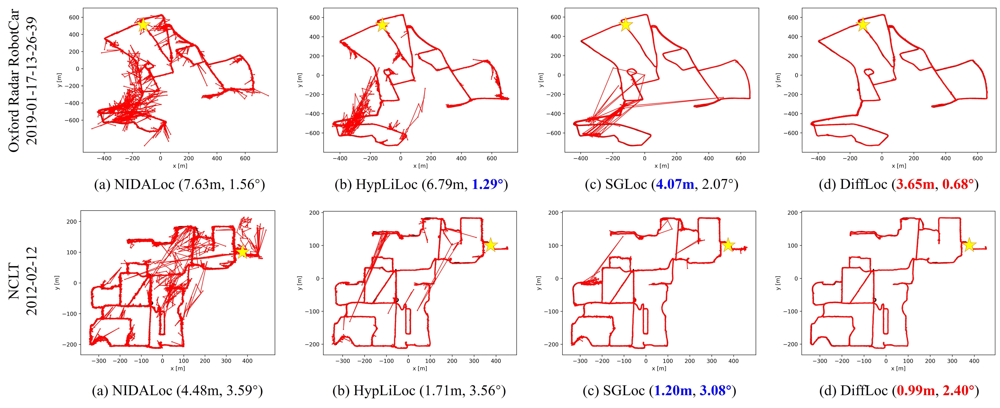

# DiffLoc
DiffLoc: Diffusion Model for Outdoor LiDAR Localization

[Paper](https://openaccess.thecvf.com/content/CVPR2024/papers/Li_DiffLoc_Diffusion_Model_for_Outdoor_LiDAR_Localization_CVPR_2024_paper.pdf) 
[Supp](https://openaccess.thecvf.com/content/CVPR2024/supplemental/Li_DiffLoc_Diffusion_Model_CVPR_2024_supplemental.pdf)
[Poster](https://drive.google.com/file/d/1P80GGOAyWRF5BICAQ990PDO0iByW2kbP/view)
[Video](https://www.youtube.com/watch?v=sSW9nHQR0nc&t=31s)


## Visualization


# Environment

- python 3.9

- pytorch 1.13

- cuda 11.6

```
source install.sh
```

## Dataset

We support the [Oxford Radar RobotCar](https://oxford-robotics-institute.github.io/radar-robotcar-dataset/datasets) and [NCLT](https://robots.engin.umich.edu/nclt/) datasets right now.

The data of the Oxford and NCLT datasets should be organized as follows:

```
data_root
├── 2019-01-11-14-02-26-radar-oxford-10k
│   ├── xxx.bin
│   ├── xxx.bin
├── Oxford_pose_stats.txt
├── train_split.txt
├── valid_split.txt
```

## Data prepare

- NCLT: We use [NCLT Sample Python Scripts](https://robots.engin.umich.edu/nclt/) to preprocess velodyne_sync to speed up data reading. We provided within it [nclt_precess.py](preprocess/nclt_precess.py).

- Oxford&NCLT: We use [SPVNAS](https://github.com/mit-han-lab/spvnas) to generate static object masks to train the SOAP module. You need to download the code for SPVNAS and run the [data_prepare.py](preprocess/data_prepare.py).

**Note:** We notice the pre-trained weights for the segmentation model are no longer available for download. A backup is provided on my [Google Drive](https://drive.google.com/file/d/1jtDClM-6EnW329FtJ0WXVBopOTuVRXJG/view?usp=sharing). Please follow the installation instructions on [Docs](https://github.com/PJLab-ADG/OpenPCSeg/blob/master/docs/INSTALL.md) to install the necessary libraries. If you use the model, please cite the [corresponding paper](https://github.com/mit-han-lab/spvnas).

## Run

### Download the pretrained ViT model
We initialize DiffLoc's feature learner using the [DINOv2](https://github.com/facebookresearch/dinov2?tab=readme-ov-file).

### Train

```
accelerate launch --multi_gpu --num_processes 4 --mixed_precision fp16 train.py
```

### Test
```
python test.py
```

## Model zoo

The models of DiffLoc on Oxford, and NCLT can be downloaded [here](https://drive.google.com/drive/folders/17uhEqc7BYqLETecllyLMorI0lOI9hBiQ).

## Acknowledgement

 We would like to express our gratitude for the code shared by [RangeVit](https://github.com/valeoai/rangevit) and [PoseDiffusion](https://github.com/facebookresearch/PoseDiffusion).

## Citation

```
@inproceedings{li2024diffloc,
  title={DiffLoc: Diffusion Model for Outdoor LiDAR Localization},
  author={Li, Wen and Yang, Yuyang and Yu, Shangshu and Hu, Guosheng and Wen, Chenglu and Cheng, Ming and Wang, Cheng},
  booktitle={Proceedings of the IEEE/CVF Conference on Computer Vision and Pattern Recognition},
  pages={15045--15054},
  year={2024}
}

@inproceedings{li2023sgloc,
  title={SGLoc: Scene Geometry Encoding for Outdoor LiDAR Localization},
  author={Li, Wen and Yu, Shangshu and Wang, Cheng and Hu, Guosheng and Shen, Siqi and Wen, Chenglu},
  booktitle={Proceedings of the IEEE/CVF Conference on Computer Vision and Pattern Recognition},
  pages={9286--9295},
  year={2023}
}
```
